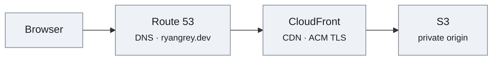
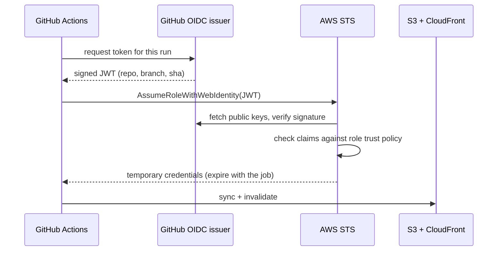

# ryangrey.dev

My personal site. One HTML file, no build step, no dependencies, no JavaScript, and no external requests — served from a private S3 bucket behind CloudFront.

**Live:** <https://ryangrey.dev>

The site is its own case study: the architecture section on the page describes the infrastructure that serves the page.

## Constraints

I set these up front and held to them:

| Constraint | Result |
| --- | --- |
| No build tooling | Edit `index.html`, sync, done. Nothing to install, nothing to break in two years. |
| No frameworks | 0 dependencies. No `node_modules`, no lockfile, no supply chain. |
| No external requests | No CDN, no analytics, no web fonts, no trackers. Nothing loads from a third party. |
| No JavaScript | 0 `<script>` tags. Dark/light theming is pure CSS via `prefers-color-scheme`. |
| System font stack | Zero font payload; renders natively on every platform. |

Total page weight, everything included:

| Asset | Size |
| --- | --- |
| `index.html` (markup + inline CSS + inline SVG) | 14.3 KB |
| Profile photo (JPEG, EXIF stripped) | 29.9 KB |
| AWS certification badge (PNG) | 44.9 KB |
| **Total** | **~87 KB** |

## Architecture



- **S3** holds the static files. The bucket is **private** — it is not a website-endpoint bucket and has no public read policy.
- **CloudFront** is the only thing allowed to read it, via **Origin Access Control (OAC)**. Requests to the bucket that do not come from the distribution are denied.
- **ACM** provides the TLS certificate (free, auto-renewing), attached to the distribution.
- **Route 53** holds the hosted zone, with an A-record alias pointing the apex domain at CloudFront.
- **`.dev` is on the HSTS preload list**, so every connection is HTTPS by force — browsers refuse plaintext to the TLD before a request is ever made.

## The interesting part: a DNSSEC teardown mid-migration

The domain started at GoDaddy and moved to Route 53. A straight nameserver cutover would have broken resolution, because the domain had **DNSSEC enabled** at the old registrar.

DNSSEC works by chaining trust: the `.dev` registry holds a **DS record** that fingerprints the signing key at the authoritative nameservers. Point the domain at new nameservers that don't have the matching key, and every validating resolver doesn't just fail — it fails *closed*. The domain goes dark, and it stays dark for as long as the stale DS record is cached, which you do not control.

So the order mattered:

1. **Delete the DS records at the `.dev` registry first**, breaking the chain of trust deliberately and while the old nameservers still answered correctly.
2. **Wait for the DS TTL to expire**, so no validating resolver still believed the domain was signed.
3. **Only then cut the nameservers over** to Route 53.

Resolution never broke. The failure mode being avoided here is a genuinely nasty one: it's invisible from any resolver that isn't validating, so it can look fine from your own machine while being completely unreachable for a large share of real users.

## Deploy

```bash
aws s3 sync . s3://<bucket> \
  --exclude ".DS_Store" --exclude "CLAUDE.md" --exclude ".claude/*"

aws cloudfront create-invalidation --distribution-id <distribution-id> \
  --paths "/index.html"
```

Notes:

- Invalidation propagates in roughly 1–2 minutes.
- CloudFront's free tier covers 1,000 invalidation paths per month, so specific paths beat `"/*"` — a wildcard is one path against quota but throws away the whole cache.
- The excludes matter. Without them the sync happily uploads local tooling config into a public bucket.

## Certification

The AWS Certified Cloud Practitioner badge on the site links to [its Credly verification page](https://www.credly.com/badges/805d358d-416b-4def-8691-c0c92fa5f1d6/public_url). Credly's official embed is a `<script>` from their CDN, which would have broken the no-external-requests rule — so the badge art is self-hosted and simply hyperlinked to the verification URL. Same result, independently verifiable, zero third-party calls.

## CI/CD: keyless deploys

Pushing to `main` deploys the site. There are **no AWS access keys stored anywhere** — not in GitHub secrets, not in the repo, not on a laptop.

Instead, GitHub Actions and AWS establish trust directly via **OpenID Connect**:



The job proves its identity with a short-lived signed token describing *which repo, which branch, which commit* is running. AWS verifies that signature against GitHub's published keys, checks the claims against the role's trust policy, and hands back credentials that expire when the job does. Nothing long-lived exists to leak, and there is no key to rotate.

### The trust policy is the whole security boundary

```json
"Condition": {
  "StringEquals": {
    "token.actions.githubusercontent.com:aud": "sts.amazonaws.com",
    "token.actions.githubusercontent.com:sub": "repo:ryan-grey/ryangrey.dev:ref:refs/heads/main"
  }
}
```

`StringEquals` on `sub` pins role assumption to exactly one repository and one branch. This is the part worth getting right: the OIDC provider trusts *GitHub*, not *you* — so a trust policy that omits the `sub` condition, or uses `StringLike` with a wildcard, is assumable by **any repository on GitHub**, including one an attacker creates. The condition is what turns "GitHub can assume this role" into "this repo on this branch can assume this role."

The role's permissions are scoped to match: write objects to one bucket, create an invalidation on one distribution. Nothing else.

### One subtlety worth knowing

The `sub` claim is not always what you expect. A job that references a GitHub **environment** gets a different subject entirely:

| Job configuration | `sub` claim in the issued token |
| --- | --- |
| plain push to `main` | `repo:OWNER/REPO:ref:refs/heads/main` |
| job with `environment: production` | `repo:OWNER/REPO:environment:production` |
| pull request | `repo:OWNER/REPO:pull_request` |
| tag push | `repo:OWNER/REPO:ref:refs/tags/v1.0.0` |

Adding an `environment:` block to the job — even purely for the deployment URL annotation — silently changes the claim and the role assumption starts failing with `Not authorized to perform sts:AssumeRoleWithWebIdentity`. The error names the action, not the claim that failed to match, which makes it easy to misread as a missing permission rather than a condition mismatch.

This workflow therefore has no `environment:` block, and the trust policy stays pinned to a single exact subject rather than being widened to accommodate one.

### Setup

One-time, with IAM admin credentials:

```bash
DISTRIBUTION_ID=<your-distribution-id> ./scripts/setup-oidc.sh
```

The script is idempotent and creates the OIDC provider, the role, and its policy. It derives the account ID at runtime, so no account identifiers are committed here. It prints the role ARN, which goes into the repo's secrets along with the distribution ID.

### The workflow

`.github/workflows/deploy.yml` runs on every push to `main`:

1. Assume the role via OIDC
2. `aws s3 sync --delete` the site files (excluding `README.md`, `scripts/`, `.github/`, and tooling config)
3. Create a CloudFront invalidation and **wait** for it to complete
4. Fetch the live page and assert it byte-matches the committed `index.html`

Step 4 matters: it means a green check reflects verified-live content, not just a successful upload. A `concurrency` group prevents two deploys racing onto the same bucket.

## Contents

```
index.html                          the entire site — markup, CSS, and SVG diagram
ryan-grey.jpg                       profile photo (EXIF stripped)
aws-cloud-practitioner-badge.png    self-hosted Credly badge art
ryan-grey-cv.pdf                    CV linked from the page
.github/workflows/deploy.yml        keyless CI/CD pipeline
scripts/setup-oidc.sh               one-time IAM OIDC provider + role setup
```
