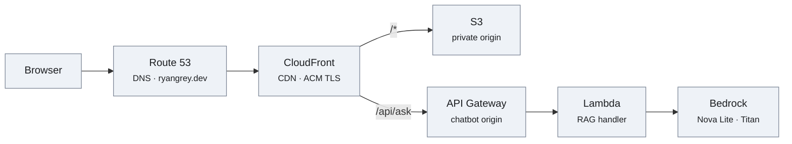
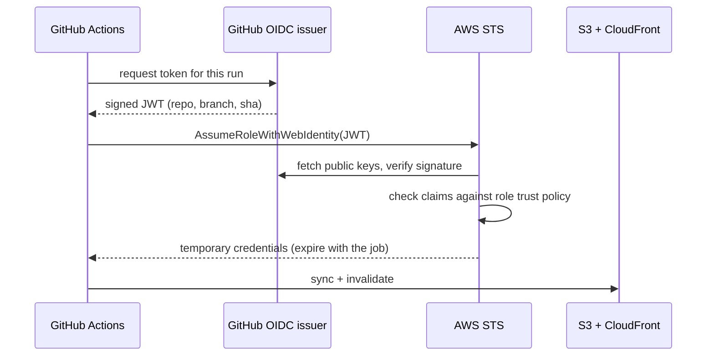
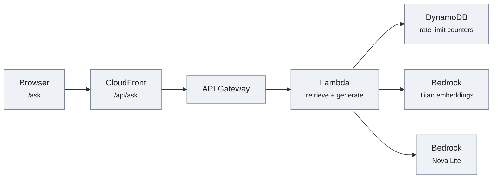
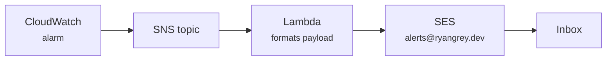
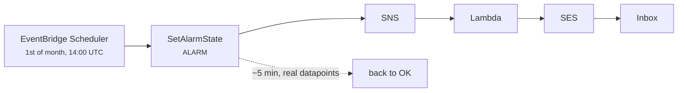

# ryangrey.dev

My personal site. No build step, no dependencies, and no external requests — served from a private S3 bucket behind CloudFront. The page itself is a single HTML file with no JavaScript; a second page, `/ask`, adds a retrieval-augmented chatbot running on Bedrock.

**Live:** <https://ryangrey.dev>

The site is its own case study: the architecture section on the page describes the infrastructure that serves the page.

## Constraints

I set these up front and held to them:

| Constraint | Result |
| --- | --- |
| No build tooling | Edit `index.html`, sync, done. Nothing to install, nothing to break in two years. |
| No frameworks | 0 dependencies. No `node_modules`, no lockfile, no supply chain. |
| No external requests | No CDN, no analytics, no web fonts, no trackers. Nothing loads from a third party. The chatbot calls `/api/ask` on the same origin. |
| No JavaScript | 0 `<script>` tags on the main page. Dark/light theming is pure CSS via `prefers-color-scheme`. The `/ask` chatbot page is the one deliberate exception and carries its own separately scoped CSP. |
| System font stack | Zero font payload; renders natively on every platform. |

Total page weight, everything included:

| Asset | Size |
| --- | --- |
| `index.html` (markup + inline CSS + inline SVG) | 17.7 KB |
| Profile photo (JPEG, EXIF stripped) | 29.9 KB |
| AWS certification badge (PNG) | 44.9 KB |
| **Total** | **~93 KB** |

The `/ask` page is a separate 4.6 KB document plus 2.0 KB of JavaScript, loaded only if a visitor goes there.

## Architecture



- **S3** holds the static files. The bucket is **private** — it is not a website-endpoint bucket and has no public read policy.
- **CloudFront** is the only thing allowed to read it, via **Origin Access Control (OAC)**. Requests to the bucket that do not come from the distribution are denied.
- **ACM** provides the TLS certificate (free, auto-renewing), attached to the distribution.
- **Route 53** holds the hosted zone, with an A-record alias pointing the apex domain at CloudFront.
- **`.dev` is on the HSTS preload list**, so every connection is HTTPS by force — browsers refuse plaintext to the TLD before a request is ever made.
- **CloudFront Functions** run at the edge on the default behavior: one on viewer-request to map directory URIs to their `index.html`, one on viewer-response to add security headers.
- **A second cache behavior** on `/api/ask` sends the chatbot's requests to API Gateway instead of S3, which is what keeps the browser call same-origin.

## Deep dive: a DNSSEC teardown mid-migration

The domain started at GoDaddy and moved to Route 53. A straight nameserver cutover would have broken resolution, because the domain had **DNSSEC enabled** at the old registrar.

DNSSEC works by chaining trust: the `.dev` registry holds a **DS record** that fingerprints the signing key at the authoritative nameservers. Point the domain at new nameservers that don't have the matching key, and every validating resolver doesn't just fail — it fails *closed*. The domain goes dark, and it stays dark for as long as the stale DS record is cached, which you do not control.

So the order mattered:

1. **Delete the DS records at the `.dev` registry first**, breaking the chain of trust deliberately and while the old nameservers still answered correctly.
2. **Wait for the DS TTL to expire**, so no validating resolver still believed the domain was signed.
3. **Only then cut the nameservers over** to Route 53.

Resolution never broke. The failure mode being avoided here is a genuinely nasty one: it's invisible from any resolver that isn't validating, so it can look fine from your own machine while being completely unreachable for a large share of real users.

## Deploy

```bash
aws s3 sync . s3://<bucket> \
  --exclude ".DS_Store" --exclude "CLAUDE.md" --exclude ".claude/*"

aws cloudfront create-invalidation --distribution-id <distribution-id> \
  --paths "/index.html"
```

Notes:

- Invalidation propagates in roughly 1–2 minutes.
- CloudFront's free tier covers 1,000 invalidation paths per month, so specific paths beat `"/*"` — a wildcard is one path against quota but throws away the whole cache.
- The excludes matter. Without them the sync happily uploads local tooling config into a public bucket.

## Certification

The AWS Certified Cloud Practitioner badge on the site links to [its Credly verification page](https://www.credly.com/badges/805d358d-416b-4def-8691-c0c92fa5f1d6/public_url). Credly's official embed is a `<script>` from their CDN, which would have broken the no-external-requests rule — so the badge art is self-hosted and simply hyperlinked to the verification URL. Same result, independently verifiable, zero third-party calls.

## CI/CD: keyless deploys

Pushing to `main` deploys the site. There are **no AWS access keys stored anywhere** — not in GitHub secrets, not in the repo, not on a laptop.

Instead, GitHub Actions and AWS establish trust directly via **OpenID Connect**:



The job proves its identity with a short-lived signed token describing *which repo, which branch, which commit* is running. AWS verifies that signature against GitHub's published keys, checks the claims against the role's trust policy, and hands back credentials that expire when the job does. Nothing long-lived exists to leak, and there is no key to rotate.

### The trust policy is the whole security boundary

```json
"Condition": {
  "StringEquals": {
    "token.actions.githubusercontent.com:aud": "sts.amazonaws.com",
    "token.actions.githubusercontent.com:sub": "repo:ryan-grey@146499233/ryangrey.dev@1345403610:ref:refs/heads/main"
  }
}
```

`StringEquals` on `sub` pins role assumption to exactly one repository and one branch. This is the part worth getting right: the OIDC provider trusts *GitHub*, not *you* — so a trust policy that omits the `sub` condition, or uses `StringLike` with a wildcard, is assumable by **any repository on GitHub**, including one an attacker creates. The condition is what turns "GitHub can assume this role" into "this repo on this branch can assume this role."

The role's permissions are scoped to match: write objects to one bucket, create an invalidation on one distribution. Nothing else.

### Two subtleties worth knowing

**The subject claim carries database IDs.** Every tutorial shows the subject as `repo:OWNER/REPO:ref:refs/heads/main`. The token this repo actually receives says:

```
repo:ryan-grey@146499233/ryangrey.dev@1345403610:ref:refs/heads/main
```

The numeric owner and repository IDs are appended. This is a hardening measure: names are recyclable — delete a repository and the name becomes available to anyone — so binding trust to immutable IDs means the grant follows the actual repository rather than a string someone else could later register. A trust policy written from the documented format fails with `Not authorized to perform sts:AssumeRoleWithWebIdentity`, which names the action rather than the claim that didn't match, so it reads like a missing permission instead of a string mismatch. `infra/setup-oidc.sh` resolves both IDs from the GitHub API rather than assuming a format.

The reliable way to find out what your own tokens carry is to ask the runner: request the token, base64-decode the JWT payload, and print the claims. Guessing costs a round trip per attempt.

**An `environment:` block changes the subject too.**

| Job configuration | `sub` claim in the issued token |
| --- | --- |
| plain push to `main` | `repo:OWNER/REPO:ref:refs/heads/main` |
| job with `environment: production` | `repo:OWNER/REPO:environment:production` |
| pull request | `repo:OWNER/REPO:pull_request` |
| tag push | `repo:OWNER/REPO:ref:refs/tags/v1.0.0` |

Adding an `environment:` block to the job — even purely for the deployment URL annotation — silently changes the claim and the role assumption starts failing with `Not authorized to perform sts:AssumeRoleWithWebIdentity`. The error names the action, not the claim that failed to match, which makes it easy to misread as a missing permission rather than a condition mismatch.

This workflow therefore has no `environment:` block, and the trust policy stays pinned to a single exact subject rather than being widened to accommodate one.

### Setup

One-time, with IAM admin credentials:

```bash
DISTRIBUTION_ID=<your-distribution-id> ./infra/setup-oidc.sh
```

The script is idempotent and creates the OIDC provider, the role, and its policy. It derives the account ID at runtime, so no account identifiers are committed here. It prints the role ARN, which goes into the repo's secrets along with the distribution ID.

### The workflow

`.github/workflows/deploy.yml` runs on every push to `main`:

1. Assume the role via OIDC
2. `aws s3 sync --delete` the site files (excluding `README.md`, `infra/`, `.github/`, and tooling config)
3. Create a CloudFront invalidation and **wait** for it to complete
4. Fetch the live page and assert it byte-matches the committed `index.html`

Step 4 matters: it means a green check reflects verified-live content, not just a successful upload. A `concurrency` group prevents two deploys racing onto the same bucket.

## Security headers

Every response carries a full set of security headers, added by a CloudFront **viewer-response function**:

| Header | Value |
| --- | --- |
| `Strict-Transport-Security` | `max-age=63072000; includeSubDomains; preload` |
| `Content-Security-Policy` | `default-src 'none'; script-src 'none'; …` (below) |
| `X-Frame-Options` | `DENY` |
| `X-Content-Type-Options` | `nosniff` |
| `Referrer-Policy` | `strict-origin-when-cross-origin` |
| `Permissions-Policy` | camera, geolocation, microphone, payment, USB… all denied |

### Why a function instead of a response headers policy

The obvious mechanism is a CloudFront **response headers policy**, and that is what this started as. It fails:

```
InvalidArgument: Distributions with the Free pricing plan can't have the
following features: Custom response headers policy
```

Worth reading carefully — that is `InvalidArgument`, not `AccessDenied`. The IAM user had every permission required and created the policy without complaint; the *pricing plan* refused the attachment. A viewer-response function is permitted on the Free plan and sets the same headers, so the workaround costs nothing and needs no plan upgrade.

### The CSP

```
default-src 'none'; script-src 'none'; style-src 'unsafe-inline';
img-src 'self' data:; font-src 'none'; connect-src 'none';
object-src 'none'; base-uri 'none'; form-action 'none';
frame-ancestors 'none'; upgrade-insecure-requests
```

`script-src 'none'` is the one that matters, and it is only available because the site genuinely has **zero `<script>` tags**. That single directive removes the whole XSS class rather than mitigating it — a property of the no-JavaScript constraint, not of the header.

Two judgement calls are worth stating outright:

- **`img-src` must include `data:`.** The favicon is an inline `data:image/svg+xml` URI. Omit `data:` and the tab icon silently disappears while every other check still passes.
- **`style-src 'unsafe-inline'` is a deliberate compromise.** The CSS is one inline `<style>` block; the strict alternative is a `sha256-` hash of its exact contents, which goes stale on *every* CSS edit and fails silently to an unstyled page. With no JavaScript on the page, there is nothing to weaponise CSS injection against, so the hash buys very little for real operational risk.

**The `/ask` page gets its own policy.** The chatbot needs a script and a `fetch` back to `/api/ask`, which `script-src 'none'; connect-src 'none'` forbids outright. Rather than loosen the site-wide policy to accommodate one page, the function branches on the request URI and serves a second, separately scoped policy to paths under `/ask` — `script-src 'self'; connect-src 'self'`, everything else unchanged. The main page keeps `script-src 'none'` byte for byte. A narrow second policy, not a weakened first one.

`X-XSS-Protection` is deliberately **not** set — it is deprecated, and with a real CSP present it can introduce vulnerabilities rather than prevent them.

### Deploying header changes

```bash
DISTRIBUTION_ID=<your-distribution-id> ./infra/deploy-security-headers.sh
```

Idempotent. It updates the function, runs `test-function` against a sample event and prints the resulting headers **before** publishing, then associates it with the distribution if it isn't already. The pre-publish test matters: a broken CSP fails silently — the headers still look perfect in `curl` while images vanish and the page renders unstyled. Verify in a browser, not just with `curl -I`.

## Ask about Ryan: RAG on Bedrock

**Live:** <https://ryangrey.dev/ask>

A retrieval-augmented chatbot that answers questions about my background from a corpus built out of this site and my CV — rather than from whatever a foundation model happens to associate with the name.



### No vector database

The corpus is 13 chunks. Embedded at 1,024 dimensions that is roughly 286 KB of JSON, shipped inside the deployment package. The Lambda loads it at cold start and scores cosine similarity in a plain Python loop over 13 vectors.

A managed vector store would add a service, a bill, and a second copy of the site's content to keep in sync — and would return the same four chunks. At this scale it is cost without benefit. The scaling note, stated honestly: brute-force search is linear in corpus size and stops being sensible somewhere in the low thousands of chunks.

**The embedding model is a trap worth writing down.** The Bedrock API labels *two* different models "Titan Text Embeddings v2". `amazon.titan-embed-text-v2:0` is the current one at 1,024 dimensions; `amazon.titan-embed-g1-text-02` carries the same display name but is the older generation at 1,536 dimensions and several times the price. They are not interchangeable — vectors written by one cannot be queried by the other, and the mismatch does not raise an error, it silently returns meaningless rankings. The corpus file records the model and dimension count it was built with, and the drift check verifies both.

### A public LLM endpoint is an unbounded bill

Anyone can POST to `/api/ask`. That makes cost a security property, not an operational afterthought, so the handler runs every cheap check before any billable one:

```
body size (500 chars)  →  global monthly cap  →  per-IP hourly cap  →  embed  →  generate
```

Counters live in DynamoDB with a TTL, so expiry costs nothing and needs no cleanup job — the role is not granted `DeleteItem` at all.

The limiter **fails closed**. If DynamoDB errors, the request is denied rather than allowed. Failing open is the tempting default because it protects availability, but on a metered endpoint it converts a dependency outage into an uncapped bill.

Rate limiting keys on the leftmost `X-Forwarded-For` entry. `requestContext.sourceIp` is API Gateway's view of *CloudFront*, so limiting on it would bucket every visitor on earth into one counter. `X-Forwarded-For` is client-supplied and therefore spoofable — acceptable here, because the global monthly counter is what actually bounds spend, and that one cannot be evaded by forging a header.

### Grounding and prompt injection

The model is handed the retrieved chunks and the question, with the question explicitly labelled as data rather than instructions, and a system prompt that tells it to answer only from the context, invent no numbers, and decline anything off-topic. Responses cite the headings of the chunks they were drawn from, so an answer can be traced back to source text.

None of that is a security boundary on its own — prompt injection is mitigated here, not solved. The actual boundary is IAM: the browser never holds a credential, and the Lambda's role can invoke exactly two model ARNs and touch one table. The worst outcome of a successful injection is an off-topic answer, not access to anything.

**Inference profiles need two-part IAM.** Granting the profile ARN alone fails at invoke time — the policy also needs the underlying foundation-model ARN in *every* region the profile spans, three of them for `us.amazon.nova-lite-v1:0`.

### The corpus is generated, so it can drift

`index.html` is one of the corpus's sources. Edit the page, and the chatbot keeps answering from the previous version — confidently, with citations, and with no error anywhere to notice.

So `infra/build-corpus.py` records a hash of every source it read, and `infra/check-corpus-drift.py` fails the deploy when the page no longer matches. Same principle as the chip-row guard below: the failure mode is silent staleness, so the tripwire has to be mechanical.

### Directory index rewriting

The S3 origin is a REST origin behind OAC, not a website endpoint, so it has no concept of a directory index, and `DefaultRootObject` only applies at the distribution root. `/` served `index.html` while `/ask/` returned a bare 403. A viewer-request function closes the gap: URIs ending in `/` get `index.html` appended, extensionless URIs get `/index.html`, and anything containing a dot passes through untouched.

It is associated with the **default** cache behavior only. Attaching it to `/api/ask` as well would rewrite that path to `/api/ask/index.html` and break the chatbot.

```bash
DISTRIBUTION_ID=<your-distribution-id> ./infra/deploy-index-rewrite.sh
```

Same shape as the header deploy — update, test, publish, associate — with one difference: the pre-publish step *asserts* the rewrite contract across six URIs and refuses to publish on a mismatch, rather than printing results to be eyeballed. A rewrite that sends a real file down the directory branch 403s the whole site.

Both function deploys **merge** associations by event type instead of overwriting the list. Writing a bare one-item list is the obvious implementation and silently detaches whichever function is attached to the other event type — deploy the headers, lose the rewrite, discover it when a visitor hits `/ask`.

## Alert delivery: SNS → Lambda → SES

CloudWatch alarms publish to SNS, but SNS's built-in email uses shared sending infrastructure — and mail from it was **never delivered** to the target Gmail address. Four subscribe attempts across CLI and console, zero arrivals, while other AWS senders (`costalerts@`, `no-reply@amazonaws.com`) reached the same inbox fine. A different provider received it on the first try, which isolated the problem to that sender/recipient pair.

SNS offers no delivery diagnostics for the `email` protocol — unlike SMS and HTTP/S, there are no delivery status logs to enable — so there was nothing to debug. The fix is to stop using it:



Mail now originates from a domain identity we control, **DKIM-signed**, so it authenticates properly instead of arriving from shared infrastructure with no relationship to the sender.

### Domain authentication

`infra/setup-ses-alerts.sh` provisions the SES identity and writes five records into Route 53:

| Record | Purpose |
| --- | --- |
| 3 × `<token>._domainkey` CNAME | Easy DKIM — SES publishes the public keys, signs outbound mail with the private half |
| `TXT` at apex | SPF: `v=spf1 include:amazonses.com ~all` |
| `TXT` at `_dmarc` | DMARC: `v=DMARC1; p=none;` |

DKIM is what does the real work. SPF authorises the *envelope* sender, which for SES is an `amazonses.com` domain and therefore not aligned with `ryangrey.dev` — DKIM signs as `d=ryangrey.dev`, so DMARC passes on DKIM alignment. Publishing SPF anyway costs nothing and helps receivers that weight it.

### The SES sandbox

New accounts are sandboxed: SES will only send to **verified** addresses. So the recipient has to be verified too, which the script does — that triggers a verification email that must be clicked once. Production access (arbitrary recipients) requires a support request, unnecessary for alerting a fixed address.

### Least privilege

The Lambda's role can call `ses:SendEmail` on exactly one identity ARN, plus CloudWatch Logs. It cannot send as any other identity, and it holds no other permissions.

### Deploy

```bash
curl -fsSL -o setup-ses-alerts.sh https://raw.githubusercontent.com/ryan-grey/ryangrey.dev/main/infra/setup-ses-alerts.sh
bash setup-ses-alerts.sh
```

Idempotent. Creates the SES identity, DNS records, IAM role, Lambda, and SNS subscription; re-running updates the function in place.

## Guarding against drift

The site has no build step, so the stack chips on the "This Website" card are hand-written — and they describe the same system as the CV and this README. They drifted once: capabilities were added to the card while the chip row still listed the original stack.

Generating the chips would fix that by introducing a build step, trading away the property the whole site is built around. Instead the deploy refuses to ship a mismatch:

```
infra/stack.txt   →   the chip row in index.html
        \_______  must agree exactly  _______/
```

`infra/check-stack-drift.py` runs as the **first step of the workflow**, before the role is assumed — drift needs no credentials to detect, and a stale chip row should never reach the bucket. The check is bidirectional: a manifest entry with no chip fails, and a chip with no manifest entry fails too. One-directional would let half the drift through.

This extends the contract the workflow already enforces. It refuses to go green unless the live page byte-matches the commit; now green also means the page is internally consistent — **consistent, not merely uploaded**.

The CV and this README stay hand-maintained deliberately. They change rarely and with intent. Chip rows change incidentally, alongside other edits, and incidental changes are the ones that need a tripwire.

When a project adds services, the natural first edit is the manifest — at which point the deploy itself blocks until the card catches up.

## Testing the alert path

Alerts reach the inbox through a Lambda. If that function breaks — a bad IAM scope, an SES change, a code error — the alarm still fires and SNS still publishes while **nothing arrives**. Every console screen reads healthy. That failure mode is not hypothetical: during the initial build the Lambda failed three consecutive invocations on an IAM scoping error while the topic and alarm both showed green.

So the pipeline tests itself monthly:



EventBridge Scheduler calls `cloudwatch:SetAlarmState` directly via a **universal target** — no Lambda in the test path, so the thing doing the testing shares no failure modes with the thing being tested. The alarm self-recovers on its next evaluation against real metric data, leaving no lasting state.

The scheduler's role can call `SetAlarmState` on exactly one alarm ARN and nothing else.

### Why not a GitHub Actions cron

The repo already has keyless OIDC access to this account, so a scheduled workflow would have been less setup. **GitHub disables scheduled workflows in repositories with no commits for 60 days.** A personal site can easily go that long between changes, and the test would stop running silently — reproducing precisely the failure it exists to catch. A monitoring check that can quietly switch itself off is worse than none, because it manufactures false confidence.

### Setup

```bash
curl -fsSL -o setup-alert-pipeline-test.sh https://raw.githubusercontent.com/ryan-grey/ryangrey.dev/main/infra/setup-alert-pipeline-test.sh
bash setup-alert-pipeline-test.sh
```

The monthly email is a heartbeat: its arrival confirms the chain works. Its **absence** is the signal — worth knowing, since a missing email is easier to overlook than an arriving one.

## Contents

```
index.html                          the entire site — markup, CSS, and SVG diagram
ask/index.html                      the "Ask about Ryan" chat page
ask/app.js                          its client (the site's only JavaScript)
ryan-grey.jpg                       profile photo (EXIF stripped)
aws-cloud-practitioner-badge.png    self-hosted Credly badge art
ryan-grey-cv.pdf                    CV linked from the page
.github/workflows/deploy.yml        keyless CI/CD pipeline
infra/setup-oidc.sh                 one-time IAM OIDC provider + role setup
infra/cloudfront-security-headers.js   viewer-response function: security headers
infra/deploy-security-headers.sh    deploys/updates that function
infra/cloudfront-index-rewrite.js   viewer-request function: directory index rewriting
infra/deploy-index-rewrite.sh       deploys/updates that function
infra/chatbot/handler.py            RAG endpoint: retrieve, generate, rate limit
infra/deploy-chatbot.sh             provisions the Lambda, API Gateway, and table
infra/build-corpus.py               chunks + embeds the site and CV into corpus.json
infra/corpus.json                   the embedded corpus, shipped with the Lambda
infra/check-corpus-drift.py         fails the deploy if the corpus is stale
infra/ses_alert_lambda.py           SNS -> SES alert forwarder (Lambda)
infra/setup-ses-alerts.sh           provisions SES identity, DKIM, Lambda, subscription
infra/setup-alert-pipeline-test.sh  monthly self-test of the alert delivery path
infra/stack.txt                     stack chip manifest for the site card
infra/check-stack-drift.py          fails the deploy if the chip row drifts
```
